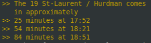

#  Oc Transpo Bus Times
This is a Mycroft skill that informs the user when OC Transpo busses arrive at a specified stop. 

## API Key
In order to use this skill, you will need an App ID and an API Key to access OC Transpo's data. Please visit [this page](https://www.octranspo.com/en/plan-your-trip/travel-tools/developers/) to learn more about the OC Transpo API and how to obtain an API key.

Then on your MyCroft skill settings page for this skill, paste in the App ID as well as the API key.

## Dialogue Example
**User:** "[Wake word], Get bus arrival times"

**Mycroft:** "Sure, for which stop number?"

**User:** "7610"

## Category
**Transport**

## Disclaimer

All data is provided by OC Transpo. Although they try their best to update it in real time, the accuracy of the data is not always guaranteed. I am not affiliated with OC Transpo nor with their services provided.

